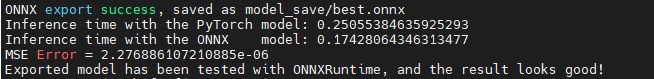
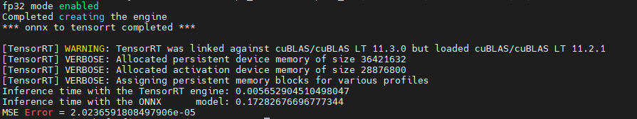
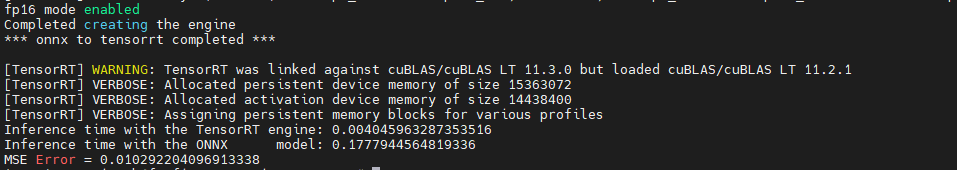
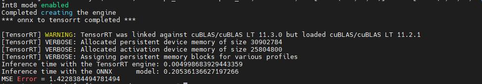
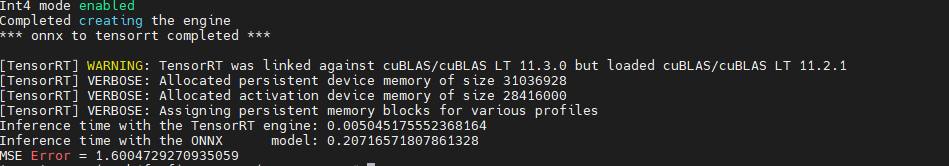
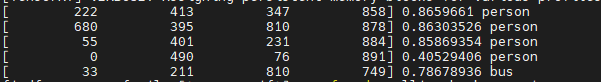
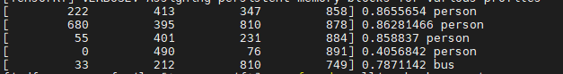
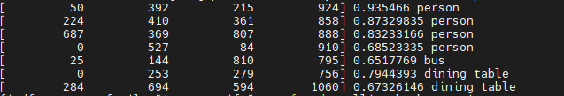
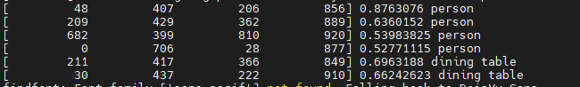

# MixPrecisionTrt 

## directory structure

```buildoutcfg
.
├── calibrator.py
├── detect.py
├── doc
│   ├── 3.6res.png
│   ├── ...
├── export.py
├── LICENSE
├── Logger.py
├── model_save
│   └── yolov5s_calibration.cache
├── README.md
├── tensorrt_engine.py
├── test_image
│   ├── bus.jpg
│   └── zidane.jpg
├── util_trt_modify.py
└── util_trt.py


```

## 一· 环境搭建

环境：ubuntu：18.04

cuda：11.1

cudnn：8.0

tensorrt：7.2.3.4

OpenCV：3.4.2

python3.8

Conda

## 二. 准备压缩的混合精度yolov5模型,保存到model_save目录下       

模型包括两部分：

1.strategy

```
strategy = [4, 4, 4, 4, 8, 4, 4, 4, 4, 4, 4, 8, 4, 4, 8, 4, 4, 8, 4, 4, 8, 4, 4, 4, 8, 8, 4, 4, 4, 8, 4, 8, 4, 4, 4,
                4, 8, 4, 6, 4, 8, 4, 4, 8, 6, 4, 4, 8, 4, 8, 8, 6, 4, 4, 8, 4, 4, 8, 4, 8, 4, 4]
```                

2.模型

[下载](https://pan.baidu.com/s/1rwmllGRgHXWLvI62JGAEEg )

提取码：wuln 


## 三. 导出export.py                                

### 3.1 加载测试图片img，test_image/bus.jpg

--img_path test_image/bus.jpg

### 3.2 使用torch.onnx.export导出yolov5s.onnx

​    onnx模型保存到pt模型的同一目录下，可以使用netron工具，查看图形化onnx模型

### 3.3 使用yolov5s.pt计算预测


```
y=model(img) 
```

### 3.4 使用ONNX Runtime计算预测

```
ort_session = onnxruntime.InferenceSession(f)
ort_outs = ort_session.run(None, ort_inputs)
```


### 3.5 比较精度，计算mse

```
np.testing.assert_allclose(to_numpy(y[1][0]), ort_outs[0], rtol=1e-03, atol=1e-05)
mse = np.sqrt(np.mean((to_numpy(y[1][0]) - ort_outs[0]) ** 2))
```

### 3.6 结果



### 示例

```
`python export.py --weights  model_save/yolov5s.pt --img_path test_image/bus.jpg --img-size 640 --batch-size 1`
```

##   四. 生成tensorrt engine，精度转换                           

tensorrt_engine.py

util_trt_modify.py

calibrator.py

### 4.1 准备COCO数据集,onnx模型，测试图片，engine保存位置

CALIB_IMG_DIR = 'coco/images/train2017'

--onnx_model_path = 'model_save/yolov5s.onnx'

--img_path = 'test_image/bus.jpg'

--engine_model_path = "model_save/yolov5s.trt"

###   4.2 确定精度

--quantize fp32/fp16/int8/int4

###   4.3 使用engine预测

`outputs = do_inference(context, bindings=bindings, inputs=inputs, outputs=outputs, stream=stream)`

### 4.4 比较精度，计算mse

```
mse = np.sqrt(np.mean((feat[0] - ort_outs[0]) ** 2))
```

### 4.5 结果

fp32




fp16




int8



mix




### 示例

```
python tensorrt_engine.py  --quantize fp32 --onnx_model_path model_save/yolov5s.onnx --img_path test_image/bus.jpg --engine_model_path  model_save/yolov5s.trt
```

 

 

##  五.图像检测

detect.py

### 5.1选择检测使用的模型

​    --engine_model_path

​    --onnx_model_path

###  5.2选择需要检测的图片

--img_path test_image/bus.jpg

### 5.3结果

yolov5s.trt



yolov5s_fp16.trt



yolov5s_int8.trt



yolov5s_mix.trt



### mAP

`python3 coco_map.py`

```
 Average Precision  (AP) @[ IoU=0.50:0.95 | area=   all | maxDets=100 ] = 0.052
 Average Precision  (AP) @[ IoU=0.50      | area=   all | maxDets=100 ] = 0.128
 Average Precision  (AP) @[ IoU=0.75      | area=   all | maxDets=100 ] = 0.036
 Average Precision  (AP) @[ IoU=0.50:0.95 | area= small | maxDets=100 ] = 0.024
 Average Precision  (AP) @[ IoU=0.50:0.95 | area=medium | maxDets=100 ] = 0.073
 Average Precision  (AP) @[ IoU=0.50:0.95 | area= large | maxDets=100 ] = 0.051
 Average Recall     (AR) @[ IoU=0.50:0.95 | area=   all | maxDets=  1 ] = 0.053
 Average Recall     (AR) @[ IoU=0.50:0.95 | area=   all | maxDets= 10 ] = 0.069
 Average Recall     (AR) @[ IoU=0.50:0.95 | area=   all | maxDets=100 ] = 0.070
 Average Recall     (AR) @[ IoU=0.50:0.95 | area= small | maxDets=100 ] = 0.026
 Average Recall     (AR) @[ IoU=0.50:0.95 | area=medium | maxDets=100 ] = 0.088
 Average Recall     (AR) @[ IoU=0.50:0.95 | area= large | maxDets=100 ] = 0.076
```
### 示例

```
python detect.py --engine_model_path model_save/yolov5s.trt --img_path test_image/bus.jpg   #使用engine检测

python detect.py --onnx_model_path model_save/yolov5s.trt  --img_path test_image/bus.jpg    #使用onnx检测
```

